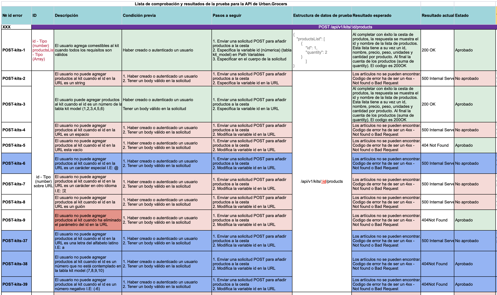

# API_Testing_QAStudy

Desarrollé una lista para comprobar la funcionalidad de los principales endpoints de la aplicación Urban Grosers, una servicio tipo Dordash/Rappi por medio del uso de Postman, encontrando fallas clave en la solicitud de pedidos, la eliminación de ordenes de clientes y otros requisitos establecidos por el cliente:

* POST /api/v1/kits/:id/products
* POST /order-and-go/v1/delivery
* PUT  /api/v1/orders/:id
* GET /api/v1/orders/:id
* DELETE /api/v1/orders/:id

En el proceso de prueba del producto aprendí a interactuar con documentación en Swagger y ApiDocs y la importancia de la creatividad y flexibilidad de un QA a la hora de diseñar y escenarios y casos de prueba que puedan dar una lectura completa del prodcuto.

A su vez, comprendí la importancia de tener un proceso claro de cara al usuario de tal forma que este no cometa errores inducido por un mal flujo de información.

* Para más detalle de los requisitos del backend de la aplicación: https://github.com/carola02/Urban_Grosers_API_Testing/blob/main/4Sprint_Requisitos_para_el_back-end_de_Urban-grocers.pdf

* Para más detalles sobre la lista de casos de prueba: https://github.com/carola02/Urban_Grosers_API_Testing/blob/main/Urban-routes_PruebasAPI_CorreccionesVF1.xlsx

  

